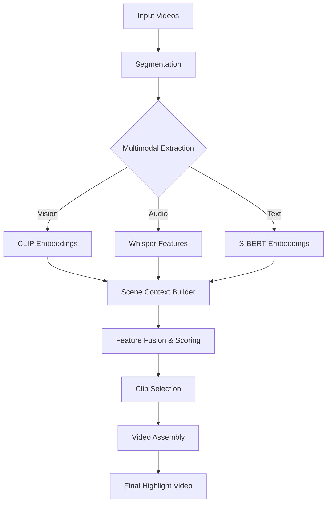

# shortClip

**shortClip** is an intelligent, multimodal video highlight generator. It automates the process of summarizing long-form content by analyzing visual, auditory, and semantic features to extract and remix the most meaningful moments into a concise highlight reel.

---

## 🚀 Project Goal

Build a system that takes multiple long videos and produces a single short video by:
1.  **Understanding** content using multiple modalities (Video, Audio, Language).
2.  **Scoring** moments based on "interestingness" and relevance.
3.  **Preserving** context (not just random clips).
4.  **Remixing** selected clips into a seamless output.

**Philosophy & Constraints:**
-   **No Frontend**: Pure backend processing pipeline.
-   **No Deployment**: Runs locally as a CLI tool.
-   **Modularity**: One responsibility per file.
-   **Simplicity**: One step at a time.

---

## 🏗️ Architecture

The system follows a linear pipeline architecture where data flows through distinct processing stages.



### Key Components

1.  **`MultimodalPipeline` (`shortclip/pipeline/multimodal_pipeline.py`)**
    The central orchestrator that manages the flow of data between all other components. It implements the 8-stage process:
    1.  **Segmentation**: Splitting video into fixed time windows (default: 2s).
    2.  **Visual Processing**: Extracting frame embeddings using `openai/clip-vit-base-patch32`.
    3.  **Audio Processing**: Extracting audio features and transcripts using `openai/whisper`.
    4.  **Text Processing**: Generating semantic embeddings using `sentence-transformers/all-mpnet-base-v2`.
    5.  **Scene Context**: Aggregating raw features into `SceneContext` objects containing all metadata for a window.
    6.  **Fusion (Scoring)**: Using a trained `FusionModel` to predict an "interest score" for each moment.
    7.  **Selection**: Choosing the best clips based on scores, ensuring diversity and constraints.
    8.  **Assembly**: Stitching selected clips together using `moviepy`.

2.  **`FusionModel` (`shortclip/models/fusion_model.py`)**
    A lightweight neural network that takes concatenated embeddings (Visual + Audio + Text) and outputs a scalar score (0-1).

3.  **`FeatureFusion` (`shortclip/pipeline/feature_fusion.py`)**
    Handles the mechanics of scoring, including:
    -   Embedding normalization (L2).
    -   Temporal smoothing (Gaussian filter) to ensure coherent clip selection (smoothing out noise).

---

## ⚙️ Configuration

The system is highly configurable via `config.yaml`.

```yaml
models:
  vision:
    name: "openai/clip-vit-base-patch32"
    embedding_dim: 512
  audio:
    name: "openai/whisper-base"
    embedding_dim: 1280
  text:
    name: "sentence-transformers/all-mpnet-base-v2"  # Excellent for semantic search
    embedding_dim: 768
  fusion:
    input_dim: 2560  # 512 + 1280 + 768
    hidden_dims: [1024, 512]
    output_dim: 1    # Single scalar score

processing:
  window_size_sec: 2       # Base unit of analysis
  frame_sampling_fps: 0.5  # Frames per second to analyze for CLIP
  batch_size: 16           # Inference batch size
  device: "cuda"           # 'cuda' or 'cpu'
  temporal_smoothing_sigma: 1.0 # Sigma for gaussian smoothing of scores

selection:
  max_clips_per_video: 2   # Max highlights to pull from a single source
  min_clip_sec: 2          # Minimum duration of a highlight
  max_clip_sec: 10         # Maximum duration of a highlight
```

---

## 📦 structure

```text
d:\autoClip_01
├── autoClip/               # Python Environment (Virtual Env)
├── shortclip/              # Source Package
│   ├── models/             # PyTorch Model Definitions
│   │   └── fusion_model.py
│   ├── pipeline/           # Core Processing Logic
│   │   ├── multimodal_pipeline.py  # Orchestrator
│   │   ├── feature_fusion.py       # Scoring & Smoothing
│   │   ├── scene_context.py        # Data Aggregation
│   │   ├── video_segmenter.py      # Video Slicing
│   │   ├── ... (processors for audio, visual, text)
│   └── scripts/            # Entry points
│       └── process_video.py
├── config.yaml             # Main Configuration
├── requirements.txt        # Dependencies
├── setup.py                # Package Setup (Empty/WIP)
└── README.md               # You are here
```

---

## 🛠️ Installation & Usage

### 1. Environment Setup

Access the environment (if not using the pre-packaged `autoClip` env):
```bash
pip install -r requirements.txt
```

### 2. Running the Pipeline

Use the `process_video.py` script to generate highlights.

**Syntax:**
```bash
python shortclip/scripts/process_video.py \
    --videos <path1> <path2> ... \
    --output <output_path> \
    [--query <text_query>] \
    [--config <config_path>]
```

**Example:**
Create a highlight reel from a podcast, focusing on "technology trends":
```bash
python shortclip/scripts/process_video.py \
    --videos data/podcast_full.mp4 \
    --output results/highlight_reel.mp4 \
    --query "future technology trends ai"
```

### 3. Troubleshooting

*   **Missing Model Error**: The pipeline requires a trained `FusionModel`. Currently, the `MultimodalPipeline` expects a `model_path` argument, but the CLI script `process_video.py` does not yet expose this argument. *This is a known issue being addressed.*
*   **CUDA OOM**: If you run out of memory, try reducing `batch_size` in `config.yaml` or switching `device` to `"cpu"`.

---

## 🧠 Development Status

*   **Pipeline**: Implemented (Segmentation -> Selection -> Assembly).
*   **Models**: Wrappers for CLIP, Whisper, MPNet implemented.
*   **Fusion**: Model architecture defined, but pre-trained weights are currently missing from the repo.
*   **CLI**: Basic implementation available.